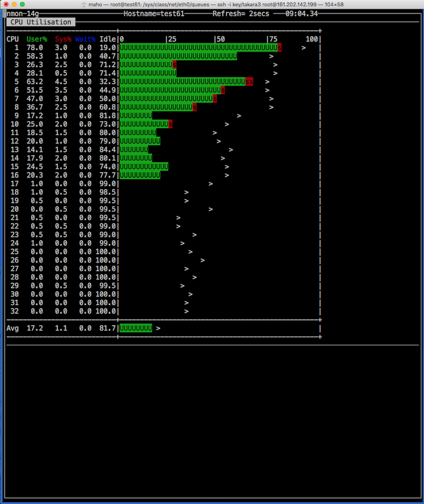
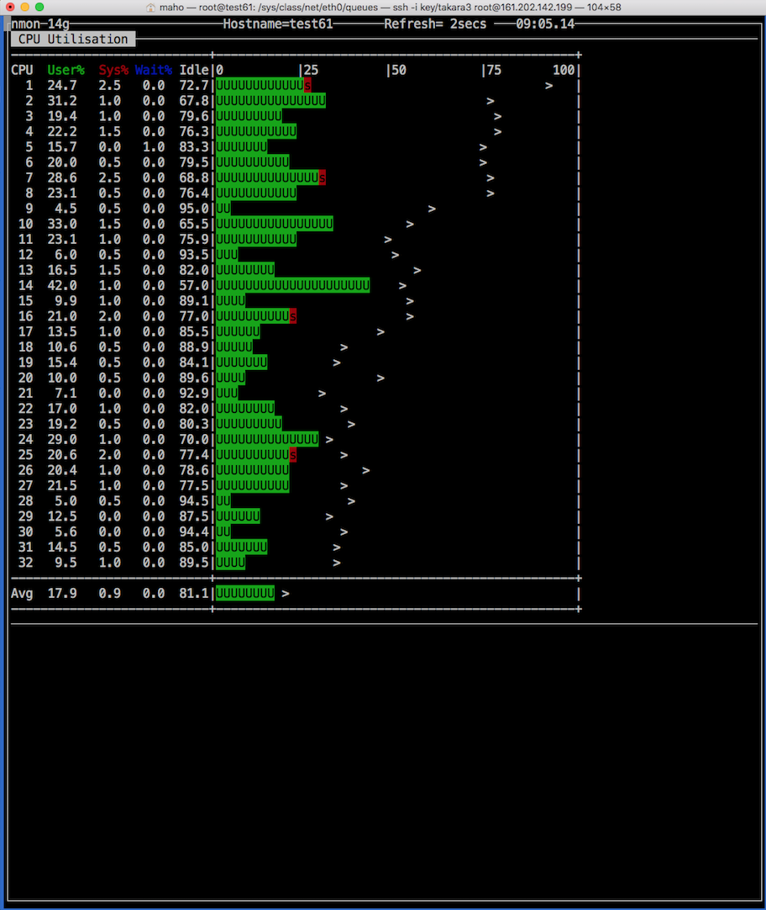

# マルチコア デュアルCPU 以上のベアメタルの負荷均等化

このツールは、LinuxカーネルのRFS (Receive Flow Steering)を利用して、マルチCPU環境の負荷の偏りを調整するものです。

## コンピュータ・アーキテクチャによる課題

E5-2600シリーズを搭載するデュアルCPUタイプのサーバーでは、2個のCPUの中でCPU#0に負荷が偏るケースがあります。
インテル・アーキテクチャのマルチCPUのサーバーは、NUMA(Non-Uniform Memory Access)アーキテクチャを採用しており、CPU#0にI/Oを接続して、CPU#1に拡張ボードを接続する事が一般的の様です。

CPU#0にネットワーク・インタフェースが接続されているため、適切なチューニングを実施しなければ、次のスクリーン・ショットの様に、CPU#0に負荷が偏り、CPU#1が利用されない状態になります。

ウェブサーバーやマイクロサービスを提供するサービスでは、Linuxのプロセスは、ネットワークからの要求を待ち受け、要求受け取ると実行状態へ遷移するために、プロセスがCPU#0に割当たる為です。

(注) IBM POWER CPU のNUMAアーキテクチャでは、それぞれのNUMAノードにNICを接続する構造となっており、本ツールの有効性は確認できていません。

## RFS (Receive Flow Steering) の参考資料のリンク

RFSはLinuxカーネル2.6.35以降で利用する事ができます。

　　　Linuxカーネル2.6.35での新機能としては、まずマルチCPU環境でネットワークスループットを向上させる「Receive Packet Steering（RPS）」および「Receive Flow Steering（RFS）」という仕組みの導入が挙げられる。これはGoogleによって提供されたもので、送受信するパケットの処理を複数のCPUに割り当てることで負荷を分散させ、スループットの向上を図るというもの。8コアのCPUを搭載するサーバーで行ったベンチマークテストでは、2〜3倍ものスループット向上やレイテンシの軽減が確認できたという。　引用元 https://mag.osdn.jp/10/08/02/0454258

      Receive Flow Steering (RFS) は RPS の動作を拡張し、CPU キャッシュヒット率を高めることで、ネットワーク遅延を減らします。RPS がキューの長さのみに基づいてパケットを転送する部分で、RFS は RPS バックエンドを使用して最適な CPU を計算し、その後にパケットを消費するアプリケーションの場所に基づいてパケットを転送します。これにより、CPU キャッシュ効率が高まります。RFS はデフォルトで無効になっています。 引用元 https://access.redhat.com/documentation/ja-jp/red_hat_enterprise_linux/6/html/performance_tuning_guide/network-rfs
      

## 使い方

設定状態の表示

~~~
# ./disp_rfs.sh
~~~

RFS設定実施

~~~
# sudo ./set_rfs.sh
~~~

リセット

~~~
# sudo ./reset_rfs.sh
~~~

# 効果

設定前

設定後

