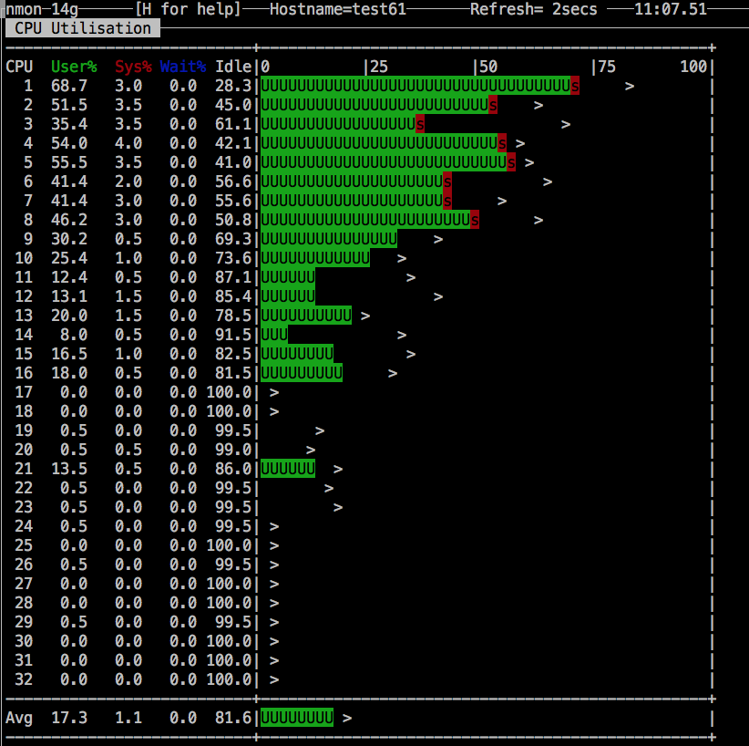
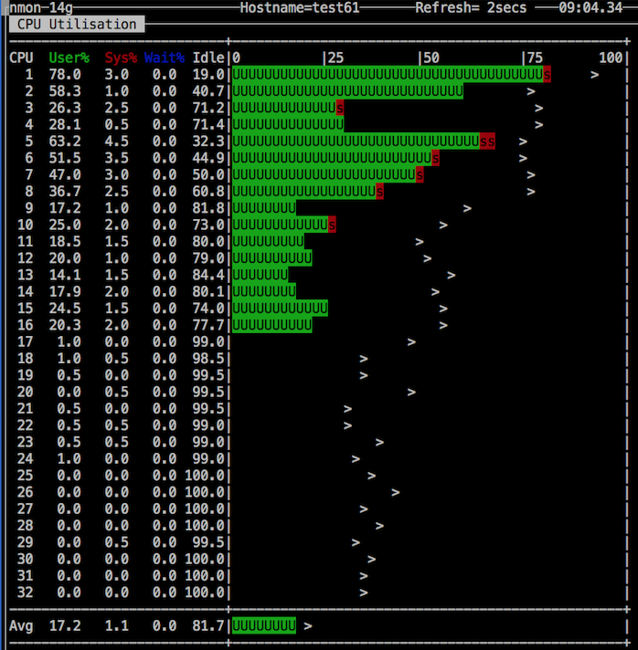
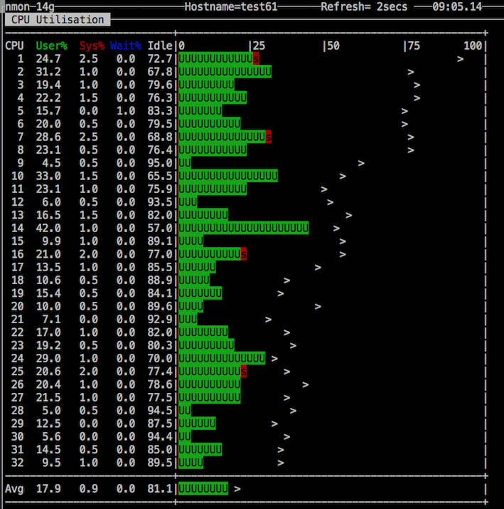

# マルチコア デュアルCPU 以上のベアメタルの負荷均等化

このツールは、LinuxカーネルのRFS (Receive Flow Steering)を利用して、マルチCPU環境の負荷の偏りを調整するものです。

## コンピュータ・アーキテクチャによる課題

E5-2600シリーズを搭載するデュアルCPUタイプのサーバーでは、2個のCPUの中でCPU#0に負荷が偏るケースがあります。
インテル・アーキテクチャのマルチCPUのサーバーは、NUMA(Non-Uniform Memory Access)アーキテクチャを採用しており、CPU#0にI/Oを接続して、CPU#1に拡張ボードを接続する事が一般的のためです。

一般にCPU#0にネットワーク・インタフェースが接続されているため、適切なチューニングを実施しなければ、次のスクリーン・ショットの様に、CPU#0に負荷が偏り、CPU#1が利用されない状態になります。このサーバーはE5-2620v4を２個搭載するベアメタルサーバーで、合計16コアで各２スレッドありますから、nmonやtopコマンドから32個の仮想CPUとして見えます。よって、画面上では1〜16にCPU時間が発生し、17以降では、ほとんどCPUが利用されていません。

ウェブサーバーやマイクロサービスを提供するサービスでは、Linuxのプロセスは、ネットワークからの要求を待ち受け、要求受け取ると実行状態へ遷移するために、プロセスがCPU#0に割当たる為です。

(注) IBM POWER CPU のNUMAアーキテクチャでは、それぞれのNUMAノードにNICを接続する構造となっており、本ツールの有効性は確認できていません。

## RFS (Receive Flow Steering) の参考資料のリンク

RFSはLinuxカーネル2.6.35以降で利用する事ができます。下記に参考になるサイトの記事を引用しておきます。

OSDN オープンソース・ソフトウェアの開発とダウンロード

> Linuxカーネル2.6.35での新機能としては、まずマルチCPU環境でネットワークスループットを向上させる「Receive Packet Steering（RPS）」および「Receive Flow Steering（RFS）」という仕組みの導入が挙げられる。これはGoogleによって提供されたもので、送受信するパケットの処理を複数のCPUに割り当てることで負荷を分散させ、スループットの向上を図るというもの。8コアのCPUを搭載するサーバーで行ったベンチマークテストでは、2〜3倍ものスループット向上やレイテンシの軽減が確認できたという。　引用元 https://mag.osdn.jp/10/08/02/0454258

RedHat パフォーマンス・チューニング・ガイド

> Receive Flow Steering (RFS) は Receive Packet Steering (RPS) の動作を拡張し、CPU キャッシュヒット率を高めることで、ネットワーク遅延を減らします。RPS がキューの長さのみに基づいてパケットを転送する部分で、RFS は RPS バックエンドを使用して最適な CPU を計算し、その後にパケットを消費するアプリケーションの場所に基づいてパケットを転送します。これにより、CPU キャッシュ効率が高まります。RFS はデフォルトで無効になっています。 引用元 https://access.redhat.com/documentation/ja-jp/red_hat_enterprise_linux/6/html/performance_tuning_guide/network-rfs

## 使い方

それぞれのシェルの中で、devという変数があります。デフォルトではeth0をセットしていますので、必要に応じて編集してください。 IBM Cloud のベアメタルでは、プライベート bond0 (eth0,eth2), bond1(eth1,eth3)となっていますが、bond0またはbond1を指定しても機能しません。 eth0〜eth3のいづれかを指定してください。

#### 表示

現在のRFSの設定状態を表示します。デフォルトでは全てゼロになっています。

~~~
# ./disp_rfs.sh
~~~

#### 設定実行

RFSを有効にして、RPSにパラメータを設定します。ルート権限で実行してください。

~~~
# sudo ./set_rfs.sh
~~~

#### 設定リセット

RFS/RPSの設定を無効にします。同様にルート権限で実行してください。

~~~
# sudo ./reset_rfs.sh
~~~

# 効果

IBM Cloud の下記のスペックのベアメタルサーバーに適用した結果のスクリーン・ショットを掲載します。

~~~
Linux: Linux version 3.13.0-137-generic (buildd@lgw01-amd64-058) 
Build: (gcc version 4.8.4 (Ubuntu 4.8.4-2ubuntu1~14.04.3) )
Release  : 3.13.0-137-generic
Version  : #186-Ubuntu SMP Mon Dec 4 19:09:19 UTC 2017
cpuinfo: model name : Intel(R) Xeon(R) CPU E5-2620 v4 @ 2.10GHz
cpuinfo: vendor_id : GenuineIntel
cpuinfo: microcode : 0xb000021
cpuinfo: cpuid level : 20
# of CPUs: 32
Machine  : x86_64
Nodename : test61
/etc/*ease[1]: DISTRIB_ID=Ubuntu
/etc/*ease[2]: DISTRIB_RELEASE=14.04
/etc/*ease[3]: DISTRIB_CODENAME=trusty
/etc/*ease[4]: DISTRIB_DESCRIPTION="Ubuntu 14.04.5 LTS"
lsb_release: Distributor ID:        Ubuntu
lsb_release: Description:   Ubuntu 14.04.5 LTS
lsb_release: Release:       14.04
lsb_release: Codename:      trusty
~~~

チューニング前の負荷が偏った状態です。

set_rfs.shを実行した後の稼働状態です。

# 設定の永続化
このシェルは設定を変更するだけで、再起動すると初期状態に戻ってしまいます。rcシェルに組み込むなどの永続化策を取ってください。

# 参考資料

* X10DRU-i+ http://www.supermicro.com.tw/products/motherboard/Xeon/C600/X10DRU-i_.cfm
* Microsoft TechNet Non-Uniform Memory Access について https://technet.microsoft.com/ja-jp/library/ms178144(v=sql.105).aspx
* LWN.net Receive flow steering https://lwn.net/Articles/382428/
* RedHat 8.8. Receive Flow Steering (RFS) https://access.redhat.com/documentation/ja-jp/red_hat_enterprise_linux/6/html/performance_tuning_guide/network-rfs
* OSDN Linuxカーネル2.6.35リリース、ネットワーク負荷軽減機構やH.264ハードウェアデコードなどをサポート https://mag.osdn.jp/10/08/02/0454258
* Scaling in the Linux Networking Stack https://www.kernel.org/doc/Documentation/networking/scaling.txt

